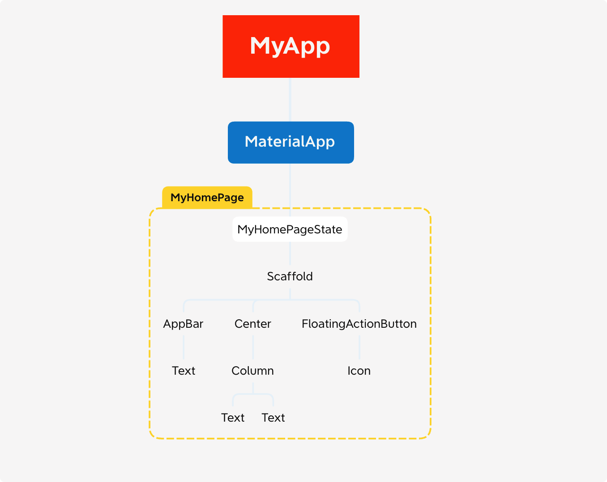

# Flutter分享

## 基础内容

### 1. 包管理和资源管理

### 2. Widget

### 3. StatelessWidget和StatefulWidget

### 4. State、状态管理

### 5、基础组件

	- 文本
	- 按钮
	- 图片
	- 表单
	- ...

### 6. 布局组件

	- 线性 Row Column
	- 弹性 Flex
	- 流式 ListView、Wrap、Flow
	- 层叠 Stack、Positioned
	- 对齐与定位

### 7. 容器类组件

### 8. 功能型组件

## 渲染机制

在默认的flutter计数器程序中，程序的结构是这样的：



所有的widget最终组成一棵树型结构，就是widget树，但是在实际的渲染中，并不是直接讲widget树渲染在屏幕上，每个widget内部的createElement会创建对呀的Element对象，形成Element树，每个Element通过其属性renderObject再构建Render树。所以最终的布局和渲染是由RenderObject完成的

### Widget部件

Widget用于描述Element的配置，是用户界面的不可变描述，也就是说Widget并不表示最终绘制在屏幕上的元素，他只是描述屏幕元素Element的一个配置数据

一个Widget可以被添加到Widget树的多个地方，每个地方在渲染的时候都会生成一个新的Element，也就是说一个Widget可以对应多个Element，一个Element仅对应一个Widget对象

Widget本身没有可变状态（所有字段都为finnal），如果要有可变状态，使用StatefulWidget子类，后者在生成Element并添加到Element树是会生成一个state对象，以保存状态

```dart
@immutable
abstract class Widget extends DiagnosticableTree {
  const Widget({ this.key });
  final Key? key;
  @protected
  @factory
  Element createElement();

  @override
  String toStringShort() {
    final String type = objectRuntimeType(this, 'Widget');
    return key == null ? type : '$type-$key';
  }

  @override
  void debugFillProperties(DiagnosticPropertiesBuilder properties) {
    super.debugFillProperties(properties);
    properties.defaultDiagnosticsTreeStyle = DiagnosticsTreeStyle.dense;
  }

  @override
  @nonVirtual
  bool operator ==(Object other) => super == other;

  @override
  @nonVirtual
  int get hashCode => super.hashCode;
  
  // 根据runtimeType和key判断是否更新element的配置，也就是复用旧的widget
  static bool canUpdate(Widget oldWidget, Widget newWidget) {
    return oldWidget.runtimeType == newWidget.runtimeType
        && oldWidget.key == newWidget.key;
  }

  static int _debugConcreteSubtype(Widget widget) {
    return widget is StatefulWidget ? 1 :
           widget is StatelessWidget ? 2 :
           0;
    }
}
```

在一个Widget中，key属性用于判断在Widget树中一个Widget如何替换另一个Widget。在下一次的build中，如果两个Widget的runtimeType和key属性相同，那他们就有同一个Element，Element调用update方法替换其配置（Widget），否则，将从Element树中删除旧的Element，再插入新Widget创建的Element

### Element

Element是在特定位置根据Widget实例化的对象，是真正显示在屏幕上的元素，Element承担着Widget配置和RenderObject布局渲染中间协调的功能

Element的生命周期如下：

- 框架调用Widget的createElement方法创建element对象，并将Widget作为其配置数据
- 当element首次添加到树中，框架调用mount方法

### RenderObject


